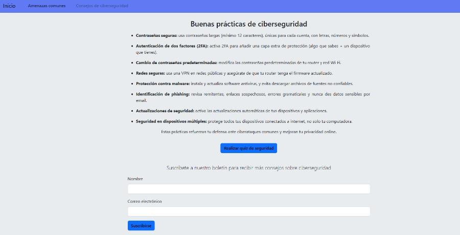

# Sitio web informativo de ciberseguridad

## Objetivo

Crear un sitio web responsivo e interactivo que informe sobre conceptos clave de ciberseguridad, amenazas comunes y consejos para proteger la privacidad en línea. El proyecto integra HTML5, CSS3, JavaScript, Bootstrap y jQuery para ofrecer una experiencia dinámica y moderna, con un enfoque en usabilidad y accesibilidad.

## Funcionalidades principales

- Página de inicio con introducción y navegación clara entre secciones.
- Sección de amenazas comunes que presenta ataques cibernéticos relevantes mediante tarjetas interactivas y un carrusel con ejemplos reales.
- Sección de consejos de seguridad con lista de buenas prácticas, un formulario validado en JavaScript para suscripción a un boletín y un modal interactivo con un test de seguridad para el usuario.
- Diseño responsivo y accesible utilizando Bootstrap.
- Interactividad mejorada con jQuery para manipulación del DOM, validación de formularios y controles dinámicos como acordeón y modal.

## Tecnologías utilizadas

HTML5 · CSS3 · JavaScript · Bootstrap · jQuery · Git · GitHub

[🌐 Demo](https://luciano-oviedo.github.io/Web-informativa-de-ciberseguridad/)



## Estructura del proyecto

- **index.html**: página principal con introducción y barra de navegación.
- **amenazas.html**: sección que detalla las amenazas comunes y presenta ejemplos interactivos.
- **buenas_practicas.html**: consejos de seguridad, formulario de suscripción y test interactivo.
- **assets/**: imágenes utilizadas en el sitio, incluyendo banner y recursos gráficos.
- **styles/**: archivo CSS con estilos personalizados para complementar Bootstrap.
- **script.js**: código JavaScript y jQuery para validación de formularios y funcionalidades interactivas.

## Ejecución y pruebas

1. Clona el repositorio:
   ```
   git clone https://github.com/Luciano-Oviedo/Web-informativa-de-ciberseguridad.git
   ```
2. Abre cualquiera de los archivos `.html` en tu navegador para navegar por el sitio.
